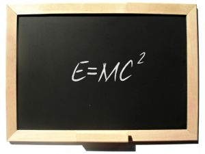

In physics, :index:`mass-energy equivalence` is the concept that the mass of a body is a measure of its energy content. In this concept, mass is a property of all energy, and energy is a property of all mass, and the two properties are connected by a constant. This means (for example) that the total :index:`internal energy` |E| of a body at rest is equal to the product of its rest mass m and a suitable conversion factor to transform from units of mass to units of energy. Albert :index:`Einstein` proposed mass-energy equivalence in 1905 in one of his :index:`Annus Mirabilis` papers entitled "Does the inertia of a body depend upon its energy-content?" [#f01]_ The equivalence is described by the famous equation:

   Albert Einstein's |E=mc²| (1905)

where |E| is energy, |m| is mass, and |c| is the speed of light in a vacuum. The formula is dimensionally consistent and does not depend on any specific system of measurement units.

.. math::
   :label: emcc

   E = mc^2

The equation :eq:`emcc` indicates that energy always exhibits :index:`relativistic mass` in whatever form the energy takes. [#f02]_ Mass-energy equivalence does not imply that mass may be "converted" to energy, but it allows for matter to be converted to energy. Through all such conversions, mass remains conserved, since it is a property of matter and any type of energy. In physics, :index:`mass` must be differentiated from :index:`matter`. Matter, when seen as certain types of particles, can be created and destroyed (as in particle annihilation or creation), but the system of precursors and products of such reactions, as a whole, retain both the original mass and energy, with each of these system properties remaining unchanged (conserved) throughout the process. Simplified, this means that the total amount of energy :math:`(E)` before the experiment is equal to the amount of energy after the experiment. Letting the m in |E=mc²| stand for a quantity of "matter" (rather than mass) may lead to incorrect results, depending on which of several varying definitions of "matter" are chosen.

.. although Sphinx *does* provide table support, it's quite basic (see http://sphinx.pocoo.org/markup/misc.html#tables). But for complex tables you can always fall back to LaTex (or HTML etc.); this also means that e.g. the table below will only be visible in the LaTex output, but not in HTML (or others)!

.. raw:: latex
   
   \begin{table}
   \centering
   \begin{tabular}{rl}
   \hline
   $E$        & energy         \\ \cline{1-2}
   $m$        & mass           \\
   $c$        & speed of light \\
   \hline
   \hline
   $E = mc^2$ & equivalence    \\
   \hline
   \end{tabular}
   \caption{Mass-energy equivalence}
   \end{table}

When energy is removed from a system (for example in binding energy, or the energy given off by an atomic bomb) then mass is always removed along with the energy. This energy retains the missing mass, which will in turn be added to any other system which absorbs it. In this situation |E=mc²| can be used to calculate how much mass goes along with the removed energy. It also tells how much mass will be added to any system which later absorbs this energy.

|E=mc²| has sometimes been used as an explanation for the origin of energy in :index:`nuclear processes`, but mass-energy equivalence does not explain the origin of such energies. Instead, this relationship merely indicates that the large amounts of energy released in such reactions may exhibit enough mass that the :index:`mass-loss` may be measured, when the :index:`released energy` (and its mass) have been removed from the system. For example, the loss of mass to atoms and neutrons as a result of the capture of a neutron, and loss of a gamma ray, has been used to test mass-energy equivalence to high precision, as the energy of the gamma ray may be compared with the mass defect after capture. In 2005, these were found to agree to 0.0004%, the most precise test of the equivalence of mass and energy to date. This test was performed in the :index:`World Year of Physics` 2005, a centennial celebration of Einstein's achievements in 1905. [#f03]_

:index:`Einstein` was not the first to propose a mass-energy relationship (see the History section). However, Einstein was the first scientist to propose the |E=mc²| formula and the first to interpret mass-energy equivalence as a fundamental principle that follows from the relativistic symmetries of space and time.